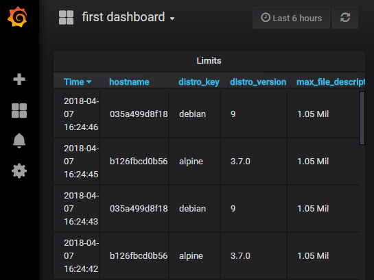

# Linux Limits to InfluxDB

[](https://goreportcard.com/report/github.com/d-led/linux_limits_to_influxdb) [](https://travis-ci.org/d-led/linux_limits_to_influxdb)

> Pushing Linux `ulimit` and `ipcs` limits into [InfluxDB](https://www.influxdata.com/)

## Configuration

Currently, configured via environment variables:

- `INFLUX_URL`
- `INFLUX_DB`
- `INFLUX_USER`
- `INFLUX_PWD`
- `LLTI_DELAY_SECONDS` - delay when running forever

## Running

- Compile as a normal Go project and run the executable
- Start with more than one command line parameter to push values only once
- The user currently needs read permission on the target database. If it's not created beforehand, the user needs the permission to do so.

## Demo/Testing

- `docker-compose up --build`
- open the shell in the influxdb container to query the DB manually:
```
# influx
Connected to http://localhost:8086 version 1.5.1
InfluxDB shell version: 1.5.1
> show databases
name: databases
name
----
llti
_internal
> use llti
Using database llti
> show measurements
name: measurements
name
----
limits
> select * from limits limit 10
name: limits
time                distro_key distro_version hostname     max_file_descriptors max_locks max_number_of_arrays max_ops_per_semop_call max_processes max_semaphores_per_array max_semaphores_system_wide semaphore_max_value user
----                ---------- -------------- --------     -------------------- --------- -------------------- ---------------------- ------------- ------------------------ -------------------------- ------------------- ----
1523109704773347685 debian     9              444e47e798f4 1048576              -1        32000                500                    1048576       32000                    1024000000                 32767               root
1523109704821112741 alpine     3.7.0          bc25099089c7 1048576              -1        32000                500                    1048576       32000                    1024000000                 32767               root
1523109707946070771 alpine     3.7.0          bc25099089c7 1048576              -1        32000                500                    1048576       32000                    1024000000                 32767               root
1523109707952562055 debian     9              444e47e798f4 1048576              -1        32000                500                    1048576       32000                    1024000000                 32767               root
1523109711008809075 alpine     3.7.0          bc25099089c7 1048576              -1        32000                500                    1048576       32000                    1024000000                 32767               root
1523109711049775876 debian     9              444e47e798f4 1048576              -1        32000                500                    1048576       32000                    1024000000                 32767               root
1523109714080606991 alpine     3.7.0          bc25099089c7 1048576              -1        32000                500                    1048576       32000                    1024000000                 32767               root
1523109714097346019 debian     9              444e47e798f4 1048576              -1        32000                500                    1048576       32000                    1024000000                 32767               root
1523109717123049616 alpine     3.7.0          bc25099089c7 1048576              -1        32000                500                    1048576       32000                    1024000000                 32767               root
1523109717156276029 debian     9              444e47e798f4 1048576              -1        32000                500                    1048576       32000                    1024000000                 32767               root
```

### Grafana

- Open `http://<DOCKER_URL>:3000` and log in with default [Grafana](https://grafana.com/) credentials `admin:admin`
- Add an InfluxDB data source named `linux_limits` with the url `http://influxdb:8086` and the DB named `llti` ([img](demo/datasources.png))
- Import [demo_dashboard.json](demo/demo_dashboard.json) at `http://<DOCKER_URL>:3000/dashboard/import`, selecting the data source above
- Check the result:



### Running as a Service in Vagrant

```
vagrant up
vagrant ssh
...
vagrant@stretch:~/.../linux_limits_to_influxdb$ go get ./...
vagrant@stretch:~/.../linux_limits_to_influxdb$ go build
vagrant@stretch:~/.../linux_limits_to_influxdb$ docker-compose up -d main influxdb
vagrant@stretch:~/.../linux_limits_to_influxdb$ ls /usr/local/bin/ll*
/usr/local/bin/llti
vagrant@stretch:~/.../linux_limits_to_influxdb$ sudo ln -s `pwd`/llti.init /etc/init.d/llti.init
vagrant@stretch:~/.../linux_limits_to_influxdb$ /etc/init.d/llti.init status
Stopped
vagrant@stretch:~/.../linux_limits_to_influxdb$ sudo /etc/init.d/llti.init start
Starting llti.init
vagrant@stretch:~/.../linux_limits_to_influxdb$ sudo /etc/init.d/llti.init status
Running
vagrant@stretch:~/.../linux_limits_to_influxdb$ docker-compose exec influxdb influx
Connected to http://localhost:8086 version 1.5.1
InfluxDB shell version: 1.5.1
> use llti
Using database llti
> select * from limits order by time desc limit 10
name: limits
time                distro_key distro_version hostname     max_file_descriptors max_locks max_number_of_arrays max_ops_per_semop_call max_processes max_semaphores_per_array max_semaphores_system_wide semaphore_max_value user
----                ---------- -------------- --------     -------------------- --------- -------------------- ---------------------- ------------- ------------------------ -------------------------- ------------------- ----
1523297671324912420 alpine     3.7.0          4b3707f9127c 1048576              -1        32000                500                    -1            32000                    1024000000                 32767               root
1523297670487376194 debian     9              stretch      1024                 -1        32000                500                    1882          32000                    1024000000                 32767               vagrant
1523297668273948884 alpine     3.7.0          4b3707f9127c 1048576              -1        32000                500                    -1            32000                    1024000000                 32767               root
1523297667448330396 debian     9              stretch      1024                 -1        32000                500                    1882          32000                    1024000000                 32767               vagrant
1523297665246755912 alpine     3.7.0          4b3707f9127c 1048576              -1        32000                500                    -1            32000                    1024000000                 32767               root
```

## Dependencies

- [influxdata/influxdb/client](https://github.com/influxdata/influxdb/tree/master/client)
- [stretchr/testify/assert](https://github.com/stretchr/testify/tree/master/assert) for test readability
- Docker (Compose), InfluxDB, Grafana, Vagrant for demo purposes
- [fhd/init-script-template](https://github.com/fhd/init-script-template)
